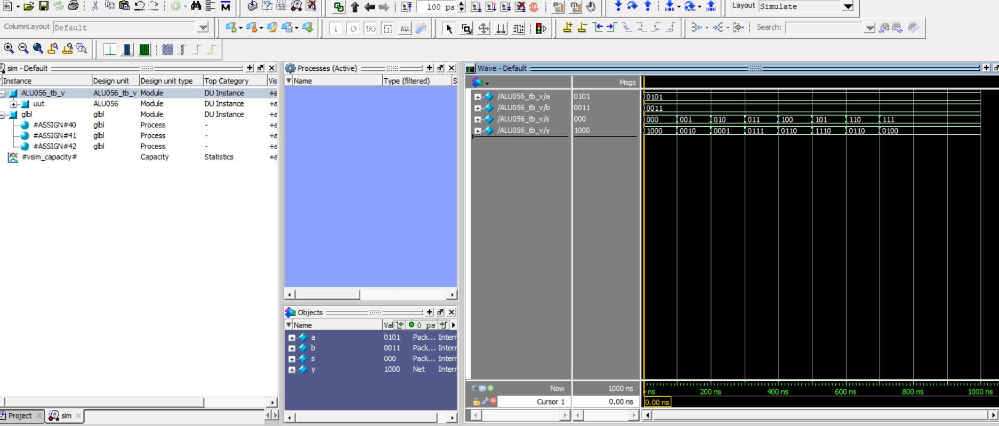

# 4-bit ALU using Verilog HDL

## Project Overview

This project implements a **4-bit Arithmetic Logic Unit (ALU)** using **Verilog HDL**.

An ALU is a digital circuit that performs arithmetic and logical operations based on the select input.

The ALU takes two 4-bit inputs, `A` and `B`, and a 3-bit select input `S`. The selected operation is produced at the 4-bit output `Y`.

## Operations

| Select `S` | Operation   |
| ---------- | ----------- |
| `000`      | Addition    |
| `001`      | Subtraction |
| `010`      | AND         |
| `011`      | OR          |
| `100`      | XOR         |
| `101`      | NAND        |
| `110`      | Increment   |
| `111`      | Decrement   |

## Inputs and Output

* `A` — 4-bit input
* `B` — 4-bit input
* `S` — 3-bit select input
* `Y` — 4-bit ALU output

The 3-bit select input provides 8 possible operation selections.

## Files

* `ALU.v` — Verilog design code for the 4-bit ALU
* `ALU_tb.v` — Verilog testbench used to verify the ALU
* `ALU_design_1.png` — ALU design screenshot
* `ALU_design_2.png` — ALU design screenshot
* `ALU_waveform.png` — Simulation waveform

## Tools Used

* Verilog HDL
* Xilinx ISE
* ISim

## Simulation

The ALU was simulated using a Verilog testbench. Different input combinations and select values were applied to verify the implemented operations.

The waveform obtained from the simulation is included in this repository.

## Design Screenshots

### ALU Design - 1

### ALU Design - 2

## Simulation Waveform

## Learning Outcome

Through this project, I practiced:

* Verilog behavioral modeling
* `always` blocks
* `case` statements
* ALU design
* Testbench development
* Verilog simulation
* Reading simulation waveforms

